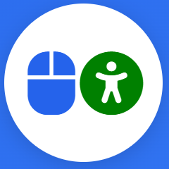

# AbleMouse

> English | [Chinese](README.cn.md) | [Russian](README.ru.md) | 🌍 Help us translate! Make the project global.

[//]: # ( )

## ✨ Open-source alternative to solutions like **MouthPad**, **eye-trackers**, or even complex systems like **Neuralink**.

> ❤️Our solution gives people with physical disabilities the power to go online — and in doing so, rediscover their self-worth, confidence, and dignity.

> [AbleMouse was selected by the ✨Product Hunt (PH) editors and received the "Featured" status. This is a significant honor. It means the world to me that people voted with their hearts.](https://www.producthunt.com/products/ablemouse-control-with-tongue-or-touch/launches)

### 🚀 [News]
>
   > AbleMouse now consists of several sub-products designed to assist users [based on their individual physical abilities](#product-compatibility-with-user-physical-abilities).
> 
> 🔥 Jan 2026  - [AbleMouse Beyond Switch](AbleMouse_Beyond_Switch_edition.md) - Control your entire PC with a single gesture. A uniquely simple approach.
> 
   > December 2025 - [AbleMouse AI Edition](AbleMouse_AI_edition.md)  is introduced. Cursor control using computer vision!
> 
   > November 2025 - [MouseCommander (win)](https://github.com/aradzhabov/AbleMouse/blob/main/src/windows/auto_hot_key/README.md) is introduced. Mouse Gesture-Controlled Quick Actions. +  [A new 3D-printable case for the ESP32 board is available](https://github.com/aradzhabov/AbleMouse/blob/main/AbleMouseDIY.md#news--november-27-2025)
> 
   > September 2025 - [AbleMouse DIY Edition](AbleMouseDIY.md) is introduced. Control your mouse with just tongue movements or simple touches on fully customizable pedals with any available body part. 
> 
---

# Product Compatibility with User Physical Abilities

> 🛈 AbleMouse now consists of several sub-products designed to assist users based on their individual physical abilities. Below is a table to help you navigate the available options and find the most suitable one for your needs. Each product name includes a link to its dedicated page with detailed information.

| User's Physical Challenge                                | Usable Body Part(s)                                                    | Recommended Product                                                                                                                                          | Release Status    | Compatible Operating Systems                                                      |
|----------------------------------------------------------|------------------------------------------------------------------------|--------------------------------------------------------------------------------------------------------------------------------------------------------------|-------------------|-------------------------------------------------------------------------------------|
| Complete paralysis of body and head                      | Can use tongue                                                        | **[AbleMouse DIY Edition](AbleMouseDIY.md)**                                                                                                                 | Already available | Windows, macOS, iOS, iPadOS, Unix (Ubuntu), Android                                |
| Complete paralysis of body and head                      | Eyes or mouth functional (no speech or head movement)                 | **[AbleMouse Beyond Switch edition](AbleMouse_Beyond_Switch_edition.md)**                                                                                                                      | 🔥Jan 2026        | Windows                                                                             |
| Complete body paralysis                                  | Can tilt, turn, or nod head; eyes or mouth functional                 | **[AbleMouse AI Edition](AbleMouse_AI_edition.md)**                                                                                                          | Already available | Windows, macOS (Unix/Ubuntu support possible — requires testing)                   |
| Poor head control (e.g., due to cerebral palsy)          | Can move other body parts (even imprecisely)                          | **[AbleMouse DIY Edition](AbleMouseDIY.md)**                                                                                                                 | Already available | Windows, macOS, iOS, iPadOS, Unix (Ubuntu), Android                                |
| Any of the above conditions                              | —                                                                     | **[MouseCommander (win)](https://github.com/aradzhabov/AbleMouse/blob/main/src/windows/auto_hot_key/README.md) as an additional tool to any above products** | Already available | Windows                                                                             |

## Who Is It For?
> This solution is designed for users who, for various reasons, are unable to operate a mouse effectively.
- People with **ALS** (Amyotrophic Lateral Sclerosis), cerebral palsy, spinal cord injuries, muscular dystrophy
- Those undergoing **rehabilitation after stroke**
>...and for those who want to help.
- **Parents, teachers, and activists** who want to provide affordable help
- Anyone who believes **assistive technology should be a right, not a privilege**

## How to Contribute

We welcome contributions! Here's how you can help:

1. **Spread the Word** - Share with communities who might benefit
2. **Improve Documentation** - Help make guides clearer and more accessible. Help translate to make this project available to non-English speakers.
3. **Develop Features** - Implement new functionality or platform support
4. **Test and Report** - Try building and report any issues

## Support
- aradzhabov@gmail.com
- [LinkedIn](https://www.linkedin.com/in/aradzhabov/)

## License

MIT License - see [LICENSE](LICENSE) file for details.

---

### Connect With Us

**#Accessibility #AssistiveTech #OpenSource #DIY #Innovation #MouthPad #eye-tracker #Neuralink**
