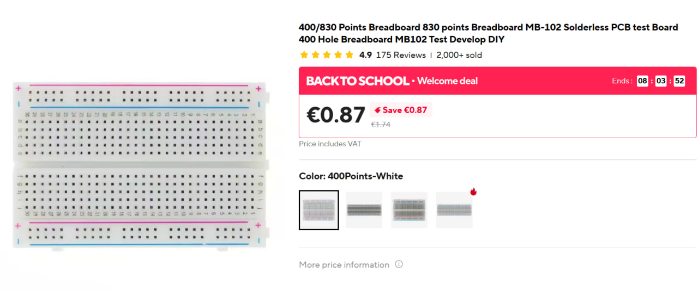
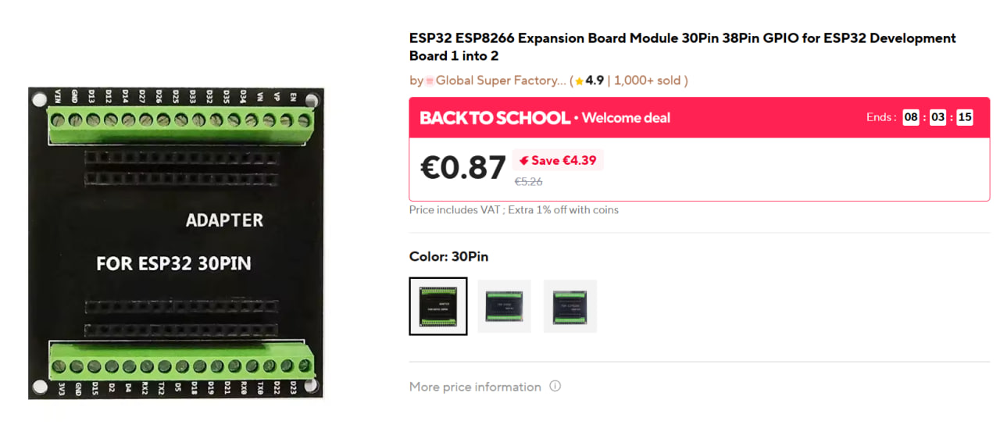
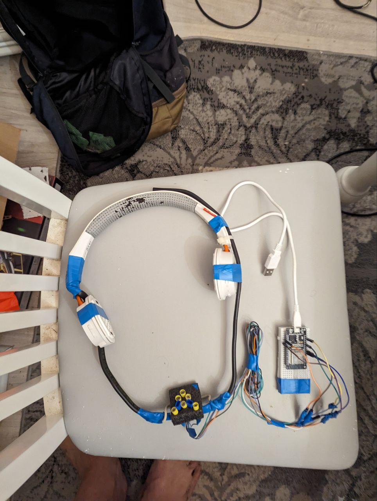

# AbleMouse. Assemble Guide.
> This guide will be updated as questions, ideas, or new implementations are contributed by the community.

This guide will help you assemble a touch-controlled device

## Table of Contents
1. [Components Needed](#components-needed)
2. [Assembly Instructions](#assembly-instructions)
3. [Software Setup](#software-setup)
4. [Final Assembly for the User](#device-configuration)
5. [Usage](#usage)

## Components Needed

### Main Components
> **Note:** The links provided are examples. You can source the components locally or from any supplier of your choice.

---

#### 1.1 ESP32 CP2102 DevKit with Wi-Fi and Bluetooth
You need a 30-pin ESP32 development board (DevKit v1).

Example: [AliExpress link](https://www.aliexpress.com/item/1005008684478950.html)

#### 1.2 Dupont Wire Assorted Kit Male to Male
10-15 cm length is sufficient.

Example: [AliExpress link](https://www.aliexpress.com/item/33027115346.html)

#### 1.3 Breadboard Options

##### Option 1: 400 Hole Breadboard
You will need to cut it in half lengthwise as ESP32 pins won't align perfectly.

Example: [AliExpress link](https://www.aliexpress.com/item/1005007085965483.html)

##### Option 2: ESP32 Terminal Adapter 30pin

Example: [AliExpress link](https://www.aliexpress.com/item/1005007171930314.html)

#### 1.4 Alligator Clips Double-ended Test Leads
48cm/18.9inch length.

Example: [AliExpress link](https://www.aliexpress.com/item/4000133770986.html)

> **Note:**  
> - For **tongue control**, this length is sufficient.  
> - For **pedals** (e.g., for users with cerebral palsy), adjust the length based on placement and user needs.

> **Note 2:**  
> If you have soldering skills, you can use flexible stranded wires of your desired length instead.

## Assembly Instructions

### 2.1 ESP32 Pin Specification
Refer to the ESP32 30-pin specification. We're interested in touch-sensitive pins.

Reference: [Last Minute Engineers ESP32 Pinout](https://lastminuteengineers.com/esp32-pinout-reference/)

### 2.2 Connect Components
Place the ESP32 on the breadboard or adapter and connect wires to the following pins:
Place the ESP32 on your breadboard (or adapter) and connect the Dupont wires to the following GPIO pins:

| Function        | ESP32 Pin |
|-----------------|---------|
| Move Left       | D4 (GPIO4)  |
| Move Right      | D15 (GPIO15)|
| Move Up         | D33 (GPIO33)|
| Move Down       | D27 (GPIO27)|
| Left Click      | D13 (GPIO13)|
| Right Click     | D32 (GPIO32)|

*Note: to control (MacOS/Windows), four direction keys are sufficient. Click buttons allow faster interaction*

### 2.3 Prototype
At this stage, you should have a working prototype with wires connected to the correct pins.

## Software Setup

### 3.1 Install Programming Software

#### 3.1.1 Download Arduino IDE
Download from: [arduino.cc/en/software/](https://www.arduino.cc/en/software/)

#### 3.1.2 Add ESP32 Support
Follow instructions at: [ESP32 Arduino Installation Guide](https://docs.espressif.com/projects/arduino-esp32/en/latest/installing.html)

#### 3.1.3 Install CP210x Drivers
Download from: [Silicon Labs CP210x Drivers](https://www.silabs.com/software-and-tools/usb-to-uart-bridge-vcp-drivers)

*Windows users need Universal Windows Driver*

#### 3.1.4 Connect ESP32 to Computer
Use USB cable for both power and data transfer.

#### 3.1.5 Select Board
In Arduino IDE, select "ESP32 Dev Module"

### 3.2 Test with Example Code

#### 3.2.1 Touch Test
Copy contents of [`touch_test_GPIO_4.ino`](../../src/touch_test_GPIO_4.ino) to a new sketch and upload.
If you encounter errors:
> **Troubleshooting:**
> - **Upload fails?** Ensure the USB cable supports data transfer.
> - **Compilation error with `std::string` → `String`?**  
>   This is due to a breaking change in ESP32 Arduino core v3.0.0.  
>   **Solution:** Downgrade to **ESP32 core v2.0.17** via Boards Manager.  
>   Full guide: [https://forum.arduino.cc/t/ble-mouse-example-compilation-error/1265845](https://forum.arduino.cc/t/ble-mouse-example-compilation-error/1265845)

    
If upload successful, you'll see messages in Serial Monitor.
Set **Tools → Serial Monitor**. Set baud rate to **115200**.

Touch the wire connected to **D4**. You should see `Touch` in the Serial Monitor.  
If so, the touch sensing is working.

#### 3.2.2 Minimal Touch Example
Copy contents of [`touch_minimal.ino`](../../src/touch_minimal.ino) to a new sketch and upload.

Open Serial Monitor at 115200 baud rate. Touch the connected wires to see corresponding messages.

Adjust `threshold` variable for sensitivity and `moveSpeed` for mouse movement speed.

##  Final Assembly for the User

### 4.1 Create Touch Panels for People with Motor Disabilities
Connect ESP32 wires to conductive surfaces (e.g., wood wrapped in foil). You can create multiple touch panels.

### 4.2 Tongue Control Interface
Experiment with placement and mounting suitable for the individual user. Some recommendations:

- Position blue contact areas to avoid accidental right/left clicks
- Set contact pads about 1mm below the edge to minimize false triggers
- Use foam for prototyping and experimenting
- Avoid permanent fixation at first; allow for adjustments

>Note: ESP32 touch pins are safe for human interaction because they use a low-power capacitive sensing method that detects changes in electrical capacitance, not direct electrical current. When you touch a connected conductive surface, your body's electrical charge alters the capacitance of the circuit, which the ESP32 reads, but there is no direct electrical connection or significant current flow through the pin to the user. But if you have any considerations you can cover the contact surface with a thin dielectric layer (0.1–0.3 mm), e.g. a common food-grade plastic bag. Note that not all dielectric materials transmit the electric field (this is distinct from electric current). The principle is kind of similar to how touchscreens work through a glass layer. But adjust the sensitivity threshold for your material — touches will be less sensitive. 

## Usage

### 5.1 Power and Operation
- Power via USB or power bank (not exceeding 5V)
- The last uploaded program runs automatically on power-up
- No need to reprogram each time

### 5.2 Bluetooth Connection
- In computer settings, find and connect to "esp-32" Bluetooth device
- Touch contacts will now control mouse movement

### 5.3 Platform Support
- Built-in accessibility features in MacOS and Windows provide computer control
- Android requires additional software for full gesture support

### 5.4 Training
- For me adaptation time took about 20 minutes
- The tongue is a sensitive muscle that adapts well to the interface
- Individual adaptation time may vary

## Advanced Options

### 6.1 Speed Control Without Reprogramming
Example file: [`touch_minimal_plus_speed_control.ino`](../../src/touch_minimal_plus_speed_control.ino)

You can implement your own control scheme using physical buttons instead of touch pins.

> This guide will be updated as questions, ideas, or new implementations are contributed by the community.