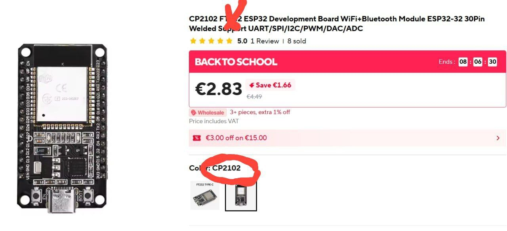

#  AbleMouse. Руководство по сборке

Это руководство поможет вам собрать устройство на основе ESP32, которое позволяет управлять курсором мыши даже если вы можете шевелить только языком. Устройство предназначено для помощи людям с ограниченными моторными функциями.

>Это руководство будет дополняться и уточняться по мере поступления вопросов и новых идей от сообщества.
---

## 1. Необходимые компоненты

*Примечание: ссылки приведены для примера. Вы можете найти аналогичные компоненты в вашей стране.*

### 1.1. Плата разработчика ESP32
Плата ESP32 DevKit с чипом CP2102, с Wi-Fi и Bluetooth. Достаточно платы с 30 контактами (pin).
*Пример: [AliExpress](https://www.aliexpress.com/item/1005008684478950.html)*

### 1.2. Провода "папа-папа" (Dupont)
Набор разноцветных проводов типа Male-to-Male длиной 10-15 см.
*Пример: [AliExpress](https://www.aliexpress.com/item/33027115346.html)*

### 1.3. Площадка для монтажа (выберите один вариант)

#### Вариант A: Макетная плата (Breadboard)
Макетная плата на 400 отверстий.
*Примечание: стандартную плату, придется распилить вдоль пополам, так как ножки ESP32 не совпадут с отверстиями.*
*Пример: [AliExpress](https://www.aliexpress.com/item/1005007085965483.html)*

#### Вариант B: Адаптер для ESP32
Готовая плата-адаптер для ESP32 на 30 pin, избавляющая от необходимости использовать и пилить breadboard.
*Пример: [AliExpress](https://www.aliexpress.com/item/1005007171930314.html)*

### 1.4. Провода с зажимами "крокодил"
Двусторонние зажимы-крокодилы для создания контактных площадок.
*Примечание: Длины 48 см достаточно для управления языком. Если вы планируете делать педали (например, для рук), длина проводов будет зависеть от конкретного расположения элементов относительно доступных частей тела конкретного человека.*
*Пример: [AliExpress](https://www.aliexpress.com/item/4000133770986.html)*
*Альтернатива: если у вас есть навыки пайки, вы можете использовать просто мягкие провода нужной длины.*

---

## 2. Сборка электрической схемы

### 2.1. Распиновка ESP32
Нас интересуют пины, чувствительные к касанию (Touch Pins). Картинка ниже показывает расположение пинов на 30-пиновой ESP32.

### 2.2. Схема подключения
Разместите ESP32 на выбранной площадке из п. 1.3 (макетной плате или адаптере). 
С помощью проводов Dupont (1.2) соедините пины ESP32 и  с проводами-"крокодилами" 1.4 согласно следующей карте:

| Функция         | Пин на ESP32 |
|-----------------|--------------|
| Движение влево  | D4 (TOUCH0)  |
| Движение вправо | D15 (TOUCH3) |
| Движение вверх  | D33 (TOUCH8) |
| Движение вниз   | D27 (TOUCH7) |
| Левый клик      | D13 (TOUCH4) |
| Правый клик     | D32 (TOUCH9) |

*Примечание: Для базового управления достаточно четырех направлений. Левый и правый клик добавляют дополнительные возможности.*

На данном этапе у вас должна получиться собранная электрическая схема, готовая для программирования и тестирования.

---

## 3. Программирование и первичная проверка

### 3.1. Установка необходимого ПО
>Чуть позже переведу текст по ссылкам, чтоб было доступно максимальному количеству людей
1.  **Скачайте и установите Arduino IDE**: https://www.arduino.cc/en/software/
2.  **Добавьте поддержку ESP32 в Arduino IDE**: следуйте официальной инструкции https://docs.espressif.com/projects/arduino-esp32/en/latest/installing.html
3.  **Установите драйверы для CP210x**: скачайте и установите драйверы с официального сайта Silicon Labs https://www.silabs.com/software-and-tools/usb-to-uart-bridge-vcp-drivers (для Windows выберите "Universal Windows Driver").
4.  **Подключите ESP32 к компьютеру** с помощью USB-кабеля (убедитесь, что кабель поддерживает передачу данных, а не только зарядку).
5.  **В Arduino IDE** выберите плату: `Tools` -> `Board` -> `ESP32 Arduino` -> `ESP32 Dev Module`.

### 3.2. Тестовый скетч (проверка касаний)

1.  Скопируйте код из файла [`touch_test_GPIO_4.ino`](../../src/esp32/touch_test_GPIO_4.ino) в новое окно Arduino IDE.
2.  Нажмите кнопку загрузки (->). Код должен скомпилироваться и загрузиться на плату.
    *   **Если возникли ошибки:**
        *   Убедитесь, что используется правильный USB-порт (`Tools` -> `Port`).
        *   Убедитесь, что кабель передает данные.
        *   Если видите ошибку, связанную с `BleMouse.cpp` (например, `cannot convert 'std::string' to 'String'`), понизьте версию платформы (espressif) ESP32 в Arduino IDE до **2.0.17** (в менеджере плат)
        согласно этой инструкции https://forum.arduino.cc/t/ble-mouse-example-compilation-error/1265845
3.  Откройте `Tools` -> `Serial Monitor`. Установите скорость (Baud Rate) `115200`.
4.  Коснитесь пальцем провода, подключенного к пину `D4`. В мониторе порта должно появиться сообщение `Touch`. Это означает, что плата и сенсорные пины работают корректно.

### 3.3. Основной скетч (эмуляция мыши)

1.  Скопируйте код из файла [`touch_minimal.ino`](../../src/esp32/touch_minimal.ino) в Arduino IDE.
2.  Загрузите его на ESP32.
3.  В Serial Monitor вы увидите сообщения о касаниях соответствующих пинов.
4.  В коде вы можете настроить параметры:
    *   `threshold` - чувствительность сенсорных пинов (чем меньше значение, тем выше чувствительность).
    *   `moveSpeed` - скорость (сколько пикселей смещение за клик) перемещения курсора мыши.

---

## 4. Создание интерфейса для пользователя

Это творческая часть, которая зависит от потребностей конкретного человека.

### 4.1. Вариант: Контактные педали (например, для ладони)
Подсоедините провода с зажимами-"крокодилами" к контактным площадкам. Площадками могут служить, например, еревянные бруски, обмотанные фольгой. Можно создать несколько независимых педалей.

### 4.2. Вариант: Площадка для управления языком
Если вы делаете площадку для управления языком, вам нужно будет поэкспериментировать с расположением и способом крепления — всё зависит от конкретного человека.
Для примера расскажу, как сделал я. Я провёл множество экспериментов и в итоге придумал и реализовал своё решение по расположению и креплению.
Примечание: синие площадки помогают избежать случайного нажатия левой и правой кнопок.
Рекомендую устанавливать контактную площадку в жёлтых направляющих примерно на миллиметр ниже края — это снизит вероятность ложных срабатываний.
Вы можете поэкспериментировать с разной высотой и расположением элементов. Например, в одном из моих вариантов "левая кнопка мыши" размещалась посередине между контактами управления направлением. В таком случае её лучше немного утопить, чтобы её уровень был чуть ниже, чем у контактов направления.
Для создания макета советую использовать поролон — с ним удобнее экспериментировать.
Также рекомендую сначала не фиксировать площадку жёстко — оставьте возможность вносить изменения в процессе настройки.

>Примечание: сенсорные пины (touch pins) ESP32 безопасны для взаимодействия с человеком, поскольку в них используется низкоэнергетический ёмкостный метод sensing, который обнаруживает изменения электрической ёмкости, а не прямой электрический ток.
Когда вы касаетесь подключенной conductive поверхности, электрический заряд вашего тела изменяет ёмкость цепи, что и считывает ESP32. При этом не происходит прямого электрического соединения или значительного протекания тока через пин к пользователю. Однако, если у вас есть какие-либо опасения, Вы можете покрыть контактную поверхность тонким диэлектрическим слоем (0,1–0,3 мм), например, обычным пищевым пластиковым пакетом. Учтите, что не все диэлектрические материалы пропускают электрическое поле (не путать с током). Принцип работы похож на то, как работают сенсорные экраны через стеклянный слой. Но не забудьте настроить порог чувствительности под ваш материал — касания будут менее чувствительными.

---

## 5. Финальная сборка и использование

1.  Соберите окончательную конструкцию, надежно закрепив все компоненты.
2.  Питание можно подать от USB-порта компьютера или от power bank (напряжение не должно превышать 5V).
3.  Включите Bluetooth на целевом устройстве (ПК, Mac, телефон).
4.  Найдите новое устройство `ESP32` и выполните сопряжение.
5.  Курсор мыши начнет двигаться при касании контактов.

*   **Windows/MacOS:** Встроенные функции специальных возможностей позволят полноценно управлять интерфейсом.
*   **Android:** Для полноценного управления может потребоваться установка дополнительного приложения-помощника для жестов мыши.

---

## 6. Дополнительные возможности

Вы можете использовать файл [`touch_minimal_plus_speed_control.ino`](../../src/esp32/touch_minimal_plus_speed_control.ino) для реализации дополнительного контроля скорости прямо с сенсорных площадок без перепрошивки. Это лишь пример — вы можете разработать свою собственную схему управления, используя не только touch-пины, но и, например, физические кнопки.

---

## 7. Обучение и адаптация

В среднем, для адаптации к управлению языком требуется около 20 минут практики. Язык — очень чувствительная и подвижная мышца, которая быстро обучается. Время адаптации индивидуально.

---

>Это руководство будет дополняться и уточняться по мере поступления вопросов и новых идей от сообщества.