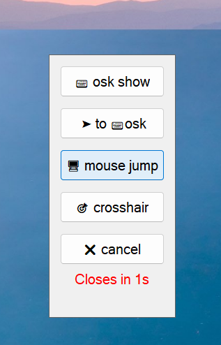

# MouseCommander - Mouse Gesture-Controlled Quick Actions

>This approach was developed in response to requests from people with disabilities who use Windows, to simplify and accelerate their workflow. It is especially designed for those who can only control a mouse pointer (without a regular mouse) and cannot use a keyboard. It enables quick movement to desired screen locations, calling the on-screen keyboard (OSK) and positioning the cursor within it, and simplifies aiming at specific points using crosshair assistance.
This approach can be easily extended with additional functions as needed.
> 
> Below is a detailed working example of a script. Using this as a foundation, you can design a custom gesture and a personalized set of available commands that best suit your needs.

## Overview
A gesture-based automation script that recognizes mouse gestures (Left → Right) to display a quick access panel with various system functions.




## Source
[mouse_commander.ahk](./cursor_commander.ahk)

## Features
- Mouse gesture recognition (Left → Right movement)
- Quick access panel with customizable actions
- On-screen keyboard control
- Visual feedback system
- Configurable hotkeys and timing settings

## Configuration Settings

### Gesture Settings
```autohotkey
gestureTimeWindow := 1000  ; Gesture time window in milliseconds
minDistance := 50          ; Minimum movement distance in pixels
maxPause := 300            ; Maximum pause between movements
menuTimeout := 3000        ; Menu close timeout after 3 seconds
```

### Hotkey Settings
```autohotkey
oskToggleHotkey := "#^o"   ; Windows+Ctrl+O - toggles OSK visibility
mouseJumpHotkey := "#+d"   ; Windows+Shift+D
crosshairHotkey := "#!p"   ; Windows+Alt+P
```

## Installation (tested with AutoHotkey v2.0 and PowerToys 0.94)
1. Install [AutoHotkey v2.0](https://www.autohotkey.com/)
2. Install [PowerToys 0.94](https://github.com/microsoft/PowerToys/releases/tag/v0.94.0)
2. Save the script with `.ahk` extension
3. Run the script

## Usage

### Basic Gesture
1. Make a LEFT mouse movement (> 50px)
2. Immediately follow with a RIGHT movement (> 50px)
3. The entire gesture must be completed within 1000ms

### Quick Panel Options
- **osk hide/show**: Toggle on-screen keyboard visibility
- **osk to cursor**: Move OSK to cursor position and focus it
- **mouse jump**: Jump the mouse pointer quickly to anywhere on your desktop.
- **crosshair**: Toggle crosshair overlay
- **Cancel**: Close the menu

### Additional Controls
- **Pause**: Toggle gesture tracking on/off
- **Ctrl+Alt+I**: Show information panel
- **Escape**: Close active GUI window

## Technical Details

### Gesture Recognition
The script uses a state machine to track mouse movements:
- State 0: Waiting for initial movement
- State 1: Left movement detected
- State 2: Right movement completes the gesture

### Feedback System
- Visual tooltips provide gesture status feedback
- Countdown timer shows menu auto-close timing
- Color-coded indicators (gray → red) for time remaining

### GUI Management
- Always-on-top tool window
- Borderless design with custom styling
- Automatic positioning near cursor
- Timeout-based auto-destruction

## Customization
Modify the configuration section to:
- Adjust gesture sensitivity (`minDistance`, `maxPause`)
- Change menu timeout duration (`menuTimeout`, `countdownTime`)
- Customize hotkey combinations
- Add new menu options and corresponding functions


## Notes
- The script automatically detects if OSK is already running
- All GUI elements are destroyed properly to prevent memory leaks
- The pause feature allows temporary disabling of gesture recognition