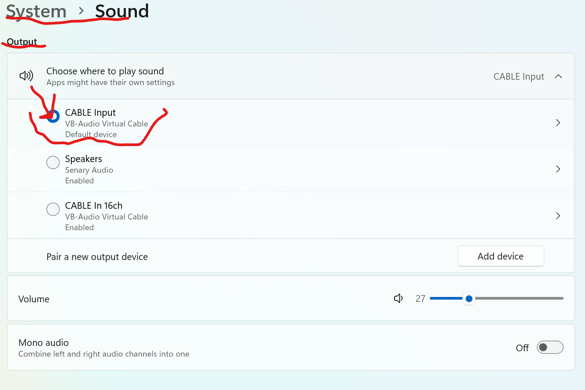
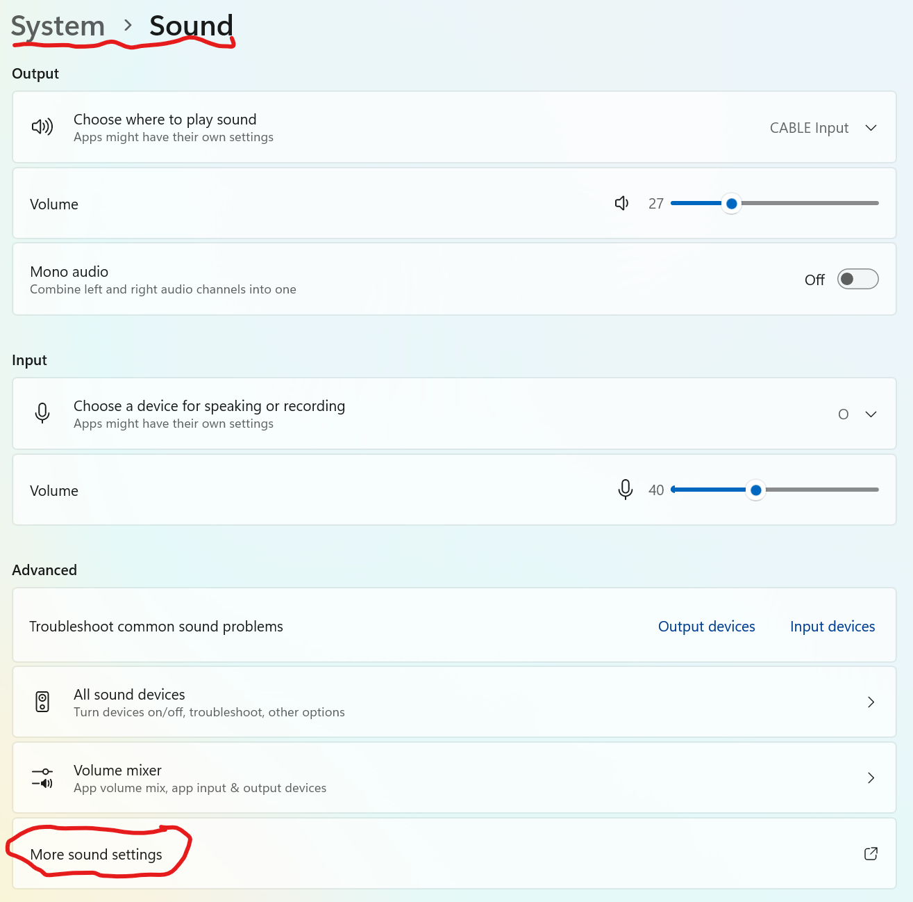
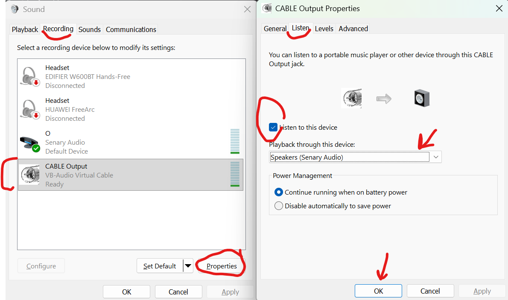

# VB-Cable Installation and Setup

> **Note:** VB-CABLE is distributed as  ([**Donationware**](https://vb-audio.com/Services/licensing.htm)). While it is free to download and use for personal purposes, a donation or license purchase is expected if you find the software useful or use it professionally. You can support the developer directly at the [VB-Audio Webshop](https://shop.vb-audio.com/en/win-apps/11-vb-cable.html).

### Why is this required?
VB-CABLE is a important component that allows the audio commands sent by the server to reach the **Windows Speech Control**. Without this setup, the system will "play" the audio, but Windows will not "hear" it as an input command.

---

### Step-by-Step Instructions

#### 1. Download and Install
* Download the driver pack: **VBCABLE_Driver_Pack45.zip** at [vb-audio.com/Cable/](https://vb-audio.com/Cable/).
* Extract the archive, run the setup as Administrator, and install.
* **Restart your computer** to complete the installation.

#### 2. Set Default Output
* Go to Windows **Settings > System > Sound**.
* In the **Output** section, select **CABLE Input (VB-Audio Virtual Cable)** as your output device.

#### 3. Open Advanced Sound Settings
* Scroll down and click on **More sound settings** (or Sound Control Panel).

#### 4. Configure Audio Routing (Loopback)
* Switch to the **Recording** tab.
* Right-click on **CABLE Output** and select **Properties**.
* In the new window, go to the **Listen** tab.
* Check the box: **"Listen to this device"**.
* In the dropdown list under "Playback through this device", select the **speakers or headphones** you normally use for audio.

---

### Result
After following these steps, any audio played by the system will be routed through **VB-CABLE**, allowing Windows to "hear" and process the played commands.
