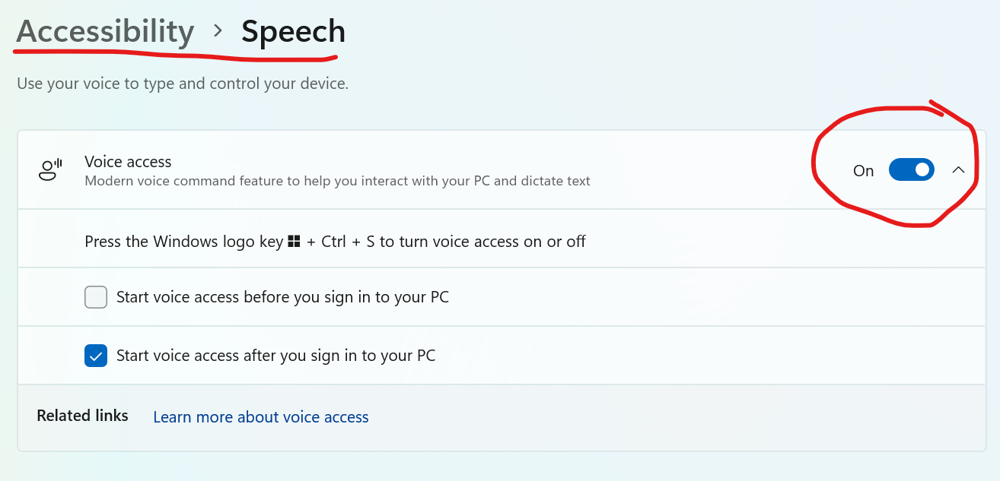
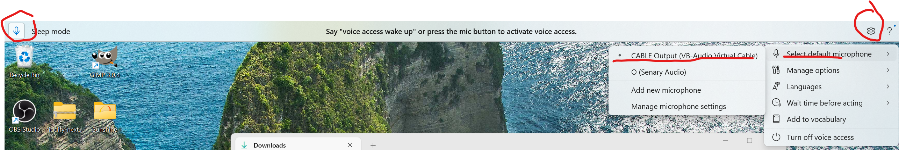

### Enabling Voice Access

1. Go to Windows **Settings > Accessibility > Speech**.
2. Toggle the **Voice access** switch to **On**.

### Configuring Audio Input

Once enabled, the Voice Access bar will appear at the top of your screen. To route the audio correctly, follow these steps:

1. Click on the **Settings** (gear icon) on the Voice Access bar.
2. Under **Select default microphone**, choose **CABLE Output (VB-Audio Virtual Cable)**.
3. Finally, switch the mode from **Sleep** to **Active** by clicking the microphone icon on the left side of the bar.

